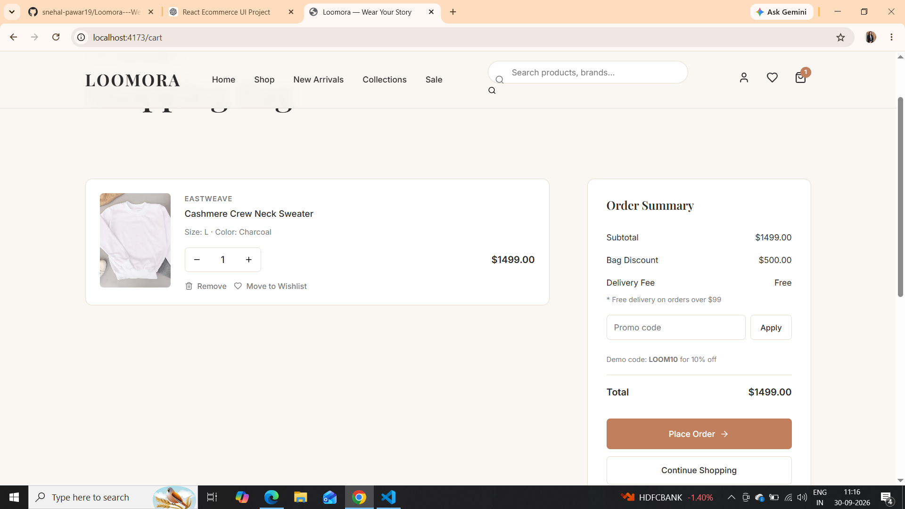

# 🛍️ Loomora — The Shopping Website

<div align="center">

## ✨ Wear Your Story

A modern, responsive fashion e-commerce website built using React.js and Vite.

</div>

---

## 📌 About Loomora

**Loomora** is a modern fashion e-commerce frontend designed to provide a smooth and engaging online shopping experience.

The website allows users to explore fashion products, search and filter products, view detailed product information, add products to their cart or wishlist, and proceed through a checkout interface.

The project focuses on creating a **responsive, reusable, and user-friendly React application** with a clean modern design.

---

## ✨ Features

- 🏠 Modern Home Page
- 🛍️ Product Listing
- 🔍 Product Search
- 🎯 Product Filtering
- ↕️ Product Sorting
- 🔎 Product Details
- ❤️ Wishlist
- 🛒 Shopping Cart
- 👤 Login & Profile UI
- 💳 Checkout Interface
- 📦 Order Success Page
- 📱 Fully Responsive Design
- ⚡ Fast Vite Development Environment
- 🧩 Reusable React Components

---

## 🛠️ Technologies Used

| Technology | Purpose |
|---|---|
| React.js | Frontend UI development |
| Vite | Development and build tool |
| JavaScript ES6+ | Application logic |
| HTML5 | Page structure |
| CSS3 | Styling and responsive design |
| React Router DOM | Page navigation |
| Context API | Global state management |
| Axios | API handling |
| Lucide React | Icons |
| ESLint | Code quality |
| Git & GitHub | Version control |

---

## 📸 Screenshots

### 🏠 Home Page


### 🛍️ Products Page


### 🔍 Product Details


### 🛒 Shopping Cart



### ❤️ Wishlist


---

## 📂 Project Structure

```text
Loomora-The-Shopping-Website/
│
├── public/
│   └── images/
│
├── Screenshots/
│   ├── Home.png
│   ├── Products.png
│   ├── Product-Details.png
│   ├── Cart.png
│   └── Wishlist.png
│
├── src/
│   ├── components/
│   ├── pages/
│   ├── context/
│   ├── data/
│   ├── services/
│   ├── App.jsx
│   ├── main.jsx
│   └── index.css
│
├── package.json
├── vite.config.js
├── index.html
└── README.md
