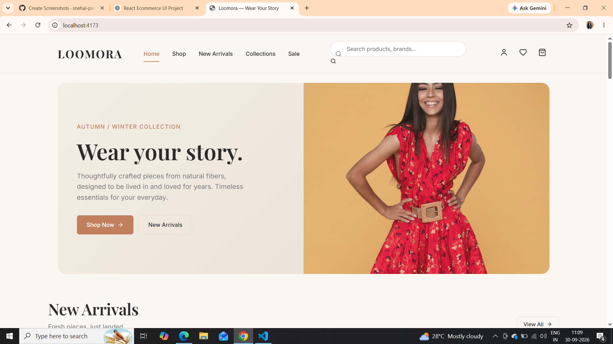
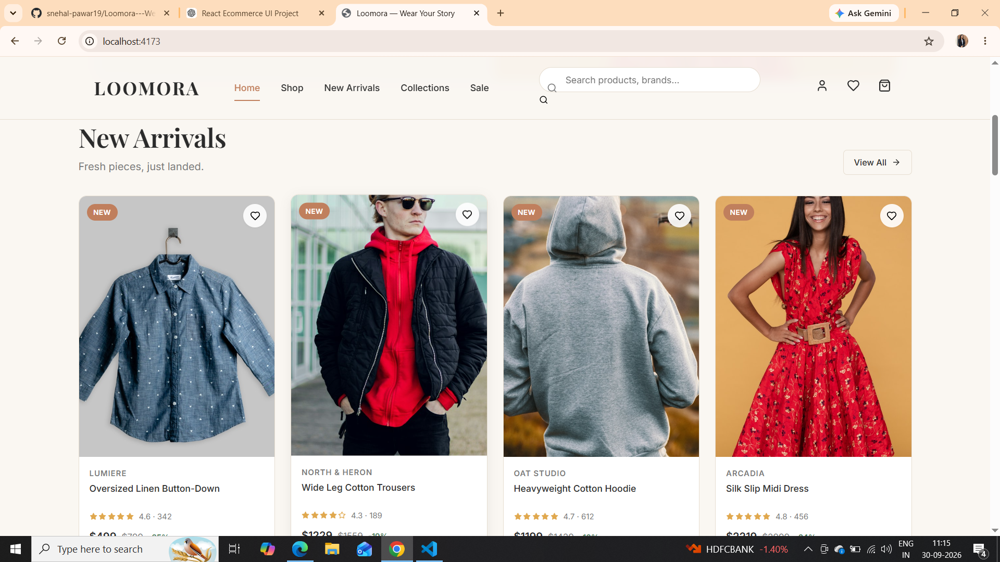

# 🛍️ Loomora – The Shopping Website

Loomora is a modern and responsive **E-commerce Frontend UI** built using **React.js and Vite**. The project focuses on creating a clean, attractive, and user-friendly online shopping experience with product browsing, product details, search, cart, wishlist, and responsive layouts.

## ✨ Features

* 🏠 **Home Page** – Attractive hero section and featured products
* 🆕 **New Arrivals** – Display of newly added products
* 🛍️ **Shop Page** – Browse available products
* 🔎 **Product Search** – Search products easily
* 📦 **Product Details** – View detailed product information
* 🛒 **Shopping Cart** – Add and manage products
* ❤️ **Wishlist** – Save favorite products
* 📱 **Responsive Design** – Optimized for desktop, tablet, and mobile
* 🔄 **React Routing** – Smooth navigation between pages
* ⚡ **Vite** – Fast development and optimized build environment

## 🛠️ Technologies Used

* **React.js**
* **JavaScript (ES6+)**
* **HTML5**
* **CSS3**
* **Vite**
* **React Router**
* **Git & GitHub**

## 📂 Project Structure

```text
Loomora-The-Shopping-Website/
│
├── public/
├── src/
│   ├── assets/
│   ├── components/
│   ├── pages/
│   ├── App.jsx
│   └── main.jsx
│
├── Screenshots/
│   ├── home.png
│   └── new-arrivals.png
│
├── package.json
├── vite.config.js
└── README.md
```

## 📸 Screenshots

### 🏠 Home Page

The Loomora Home Page provides an attractive shopping interface with navigation, hero section, product categories, and featured products.



### 🆕 New Arrivals

The New Arrivals page displays recently added products in a clean and responsive product-card layout.



## 🚀 Getting Started

Follow these steps to run the project locally.

### 1. Clone the Repository

```bash
git clone https://github.com/snehal-pawar19/Loomora-The-Shopping-Website.git
```

### 2. Navigate to the Project

```bash
cd Loomora-The-Shopping-Website
```

### 3. Install Dependencies

```bash
npm install
```

### 4. Start the Development Server

```bash
npm run dev
```

Open the local development URL shown in the terminal.

## 🎯 Project Objectives

The main objectives of Loomora are:

* To develop a modern E-commerce frontend using React.js.
* To understand component-based UI development.
* To implement client-side routing.
* To create reusable product components.
* To implement search, cart, and wishlist functionality.
* To develop a responsive and user-friendly interface.
* To gain practical experience with modern frontend development tools.

## 📚 Learning Outcomes

Through this project, I gained practical experience in:

* React components and props
* React Hooks and state management
* React Router
* Responsive UI development
* Product-card design
* Search and filtering concepts
* Cart and wishlist functionality
* Vite project setup
* Git and GitHub version control

## 🔮 Future Enhancements

* User authentication and registration
* Backend API integration
* MongoDB database integration
* Online payment gateway
* Order tracking
* Admin dashboard
* Product reviews and ratings
* User profile management

## 👩‍💻 Developer

**Snehal Pawar**

🎓 Computer Engineering / Cyber Security Student
💻 Full Stack & Frontend Development Enthusiast

### 🔗 Connect With Me

* GitHub: `https://github.com/snehal-pawar19`
* LinkedIn: `https://linkedin.com/in/snehal-pawar-0884b1278`

## ⭐ Support

If you find this project useful or interesting, consider giving the repository a ⭐ on GitHub.

---

**Loomora – A modern shopping experience built with React.js.**
